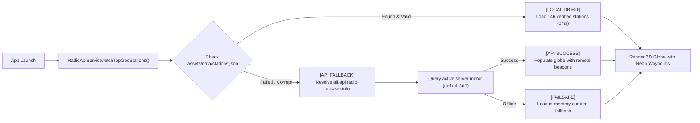

# 📻 RadioVoyage 3D

<div align="center">


### 🛰️ Next-Gen 3D Cyberpunk Earth Radio & Orbital Frequency Scanner
*Inspired by Radio Garden, reimagined with an ultra-smooth 3D sci-fi spaceship cockpit radar interface.*

</div>

---

## 🌟 Overview

**RadioVoyage** transforms global radio listening into an immersive planetary exploration experience. Instead of static lists or flat 2D maps, users pilot a high-tech orbital radar module. As the Earth rotates beneath the spacecraft, hundreds of neon radio beacons illuminate across continents. 

Locking onto any coordinate triggers glowing sound waves, laser beam vector links, and real-time audio transmissions from local cultures worldwide.

---

## ✨ Key Features

### 🌍 1. Multi-Layer 3D Orbital Globe
* **Dual Satellite Textures**: Instant toggle between high-definition **Night City Lights** and **Daytime Cloud Terran** surfaces.
* **Atmospheric Nebula Corona**: Multi-stage radial gradients simulating the blue Rayleigh scattering of Earth's atmosphere.
* **Sound Wave Radiator**: Dynamic pulsating neon frequency rings that radiate outward from the planet whenever music is broadcasting.
* **Azimuth Radar Reticle**: Continuous smooth mechanical rotation of degree markings, concentric radar range rings, and orbital guides.
* **Smooth Coordinate Focus**: Cinematic camera tracking that glides and locks onto target cities with sub-degree latitude/longitude precision.

### 🛰️ 2. Spaceship Cockpit Telemetry HUD
* **Targeting Reticles**: Corner tactical HUD brackets with a minimalist sci-fi aesthetic.
* **Orbital Telemetry Capsule**: Real-time signal lock readout, satellite synchronization status (`SAT-LINK: ACTIVE`), and active beacon count.
* **Frequency & Coordinate Readout**: Real-time GPS coordinate telemetry (`LAT / LON`) coupled with simulated space band metrics (`MHz // FM`).
* **⚡ Quantum Warp Button**: One-tap hyper-jump to a random exotic radio station anywhere on the globe, accompanied by haptic feedback.
* **Auto-Orbit Toggle**: Freely engage or pause planetary self-rotation.

### 🎵 3. High-Fidelity Live Audio Streaming
* **Powered by `just_audio`**: Low-latency, buffer-managed streaming optimized for Icecast, Shoutcast, and HLS radio protocols.
* **Spectrum Equalizer Visualizer**: Animated multi-frequency spectrum bars reacting to live stream status.
* **Playback Controls**: Instant Play/Pause, Next/Previous station skip, and connection tuning badges (`TUNING...`, `LIVE // ON AIR`, `SIGNAL LOCKED`).
* **Connection Resiliency**: Request-sequencing engine preventing race conditions and auto-filtering transient abort exceptions during rapid switching.

### 📁 4. Dual-Tier Hybrid Architecture (Offline DB + 40,000+ Online Stations)
* **Tier 1 (Instant Local DB)**: Bundled `assets/data/stations.json` containing **146 pre-scraped, verified radio beacons** across **37+ countries** (0ms load time, 100% offline capable).
* **Tier 2 (Global Remote API)**: Seamless fallback and live search connected to the **Radio-Browser API network** (over 40,000 global stations).
* **Automatic DNS Server Discovery**: Auto-resolves active server mirrors via `all.api.radio-browser.info` DNS lookups with shuffle load-balancing.
* **Official Compliance**: Full support for UUID-based tracking (`stationuuid`), ISO 3166-1 `countrycode`, and automated click reporting (`/json/url/{uuid}`).

### 🔍 5. Global Beacon Directory
* **Instant Filter Chips**: Fast one-tap filtering by country (Vietnam, Japan, UK, France, USA, etc.) and genres (Jazz, Rock, Cyberpunk, Ambient).
* **Fuzzy Real-Time Search**: Cross-references local cache with remote API databases.

---

## 🏗️ Architecture & Project Structure

```
radio_voyage/
├── android/                         # Android native config (Cleartext traffic & permissions)
├── assets/
│   ├── data/
│   │   └── stations.json            # Local database of 146+ verified radio stations
│   ├── earth_day.jpg                # High-res daytime Earth sphere texture
│   ├── earth_night.jpg              # High-res nighttime city-lights Earth texture
│   └── stars.jpg                    # Deep space cosmic backdrop texture
├── lib/
│   ├── core/
│   │   ├── constants/
│   │   │   └── app_colors.dart      # OLED void black, neon cyan, electric blue, radar grid tokens
│   │   └── theme/
│   │       └── app_theme.dart       # Dark theme powered by Orbitron & Space Grotesk fonts
│   ├── data/
│   │   ├── models/
│   │   │   ├── radio_station.dart   # Station entity with lat/lon, bitrate, codec & frequency
│   │   │   └── curated_stations.dart# Hand-curated stations with verified active streaming links
│   │   └── services/
│   │       ├── audio_player_service.dart # Stream player with ICY headers & request sequencing
│   │       └── radio_api_service.dart   # Local JSON loader + DNS discovery & API fallback
│   ├── presentation/
│   │   ├── providers/
│   │   │   └── radio_globe_provider.dart# State management: 3D globe, laser beams, playback & HUD
│   │   ├── screens/
│   │   │   └── radio_voyage_screen.dart # Main Cockpit screen & star particle field
│   │   └── widgets/
│   │       ├── globe_3d_viewport.dart   # Multi-layered 3D globe, corona & sound wave rings
│   │       ├── hud_cockpit_overlay.dart # Cockpit HUD overlay, telemetry & warp buttons
│   │       ├── station_player_sheet.dart# Bottom player, animated spectrum & station details
│   │       └── station_search_sheet.dart# Global directory modal with instant search & filter chips
│   └── main.dart                    # App entry point
├── pubspec.yaml                     # Dependencies & asset declarations
└── README.md
```

---

## 🛠️ Technology Stack

| Component | Technology | Version | Purpose |
| :--- | :--- | :--- | :--- |
| **Framework** | Flutter | `>=3.0.0` | Cross-platform mobile & desktop application |
| **Language** | Dart | `>=3.0.0 <4.0.0` | Strongly-typed sound null safety |
| **State Management** | `provider` | `^6.1.2` | Clean, reactive provider architecture |
| **3D Rendering** | `flutter_earth_globe` | `^1.0.7` | Interactive OpenGL/Canvas 3D sphere & coordinate points |
| **Audio Engine** | `just_audio` | `^0.9.40` | Robust audio streaming with buffer management |
| **Networking** | `http` | `^1.2.1` | REST client with DNS mirror discovery |
| **Typography** | `google_fonts` | `^6.2.1` | Orbitron (HUD/Telemetry) & Space Grotesk (Body) |
| **Icons** | `cupertino_icons` | `^1.0.8` | Crisp native icons |

---

## 🚀 Getting Started

### Prerequisites
* [Flutter SDK](https://docs.flutter.dev/get-started/install) installed (`3.10.0` or newer recommended).
* Android Studio / VS Code with Flutter extension.
* Physical Android/iOS device or emulator.

### Installation

1. **Clone the repository**:
   ```bash
   git clone https://github.com/your-username/radio_voyage.git
   cd radio_voyage
   ```

2. **Install dependencies**:
   ```bash
   flutter pub get
   ```

3. **Verify analyzer & tests**:
   ```bash
   flutter analyze
   flutter test
   ```

4. **Launch the application**:
   ```bash
   # Run on connected mobile device or emulator
   flutter run
   ```

---

## ⚙️ Platform Configuration

### Android
Because many internet radio stations transmit over raw HTTP Shoutcast/Icecast protocols without HTTPS, cleartext traffic is explicitly permitted:

* `android/app/src/main/AndroidManifest.xml`:
  ```xml
  <uses-permission android:name="android.permission.INTERNET"/>
  <uses-permission android:name="android.permission.ACCESS_NETWORK_STATE"/>

  <application
      android:label="RadioVoyage 3D"
      android:usesCleartextTraffic="true">
      ...
  </application>
  ```

### iOS
Add App Transport Security exceptions in `ios/Runner/Info.plist` if streaming from unencrypted HTTP endpoints:
```xml
<key>NSAppTransportSecurity</key>
<dict>
    <key>NSAllowsArbitraryLoads</key>
    <true/>
</dict>
```

---

## 📊 Station Data Pipeline



---

## 📜 License

This project is licensed under the **MIT License** — see the [LICENSE](LICENSE) file for details.

---

<div align="center">

Crafted with 💙 and ⚡ for stargazers and music explorers everywhere.

</div>
